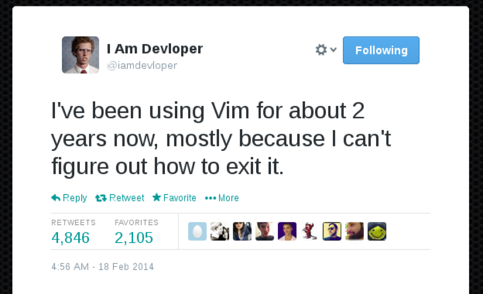
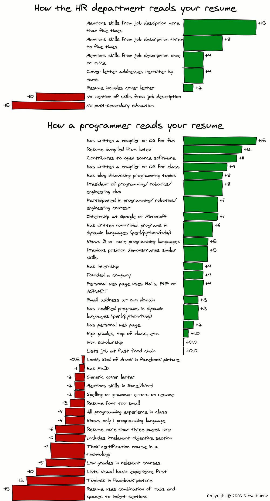
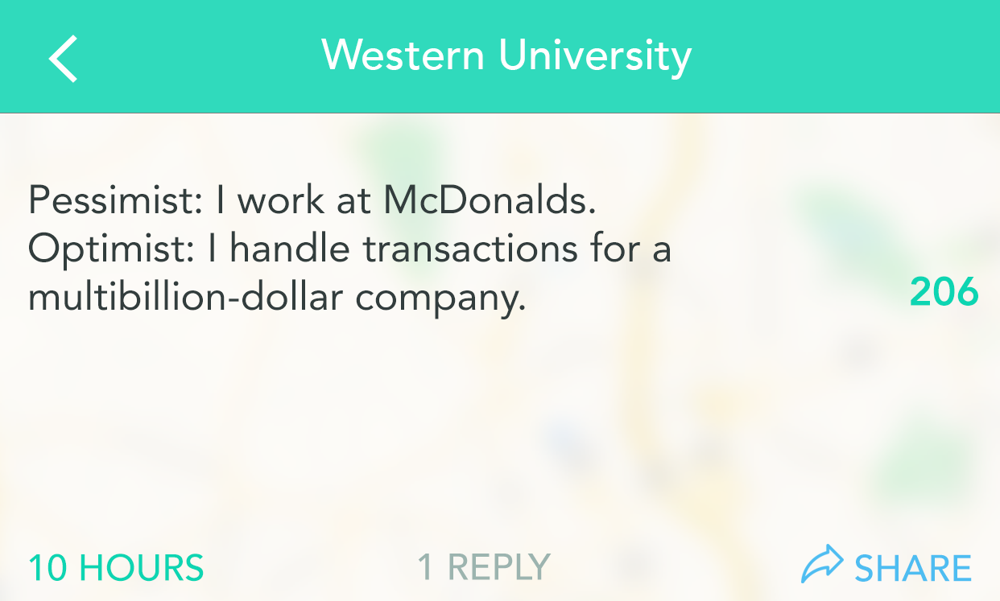

# Career Prep

## Joke of the Day 😆

`[Esc] : wq` If you forgot already

## Intro

- Why are we talking about this already???
- *SURPRISE!* The Engineering Career Fair is September 19!
- Summer Internships are HUGE advantages when applying for full-time.
    - Get your foot in the door early.

## Logistics

- September 19 10AM - 3PM @ Mizzou Arena
    - Show up early if possible!
- Professional Attire Required
- Shuttles from Alumni Center every 15 Minutes
- Research Companies beforehand!
    - See what majors/positions they're hiring for
- Bring lots of copies of your resume (more on that in a minute)
- Get business cards and add recruiters/engineers on LinkedIn

## Resume Challenge

- Due 1 week from today @ 6PM
- I will give very detailed feedback
- Ask for help if needed!

**[Resume Challenge](ResumeChallenge.md)**

  

## Sample Interview Questions

> Describe a project you worked on and what you contributed. 

> What would you do if your engineering team is making a bad technical decision, and you’re the only one who knows about it. (Actual Question from Microsoft!)

> Suppose you have 9 balls, and one is slightly heavier than the other. How do you find the heaviest one with a balance scale? (Only use the scale 2 times)