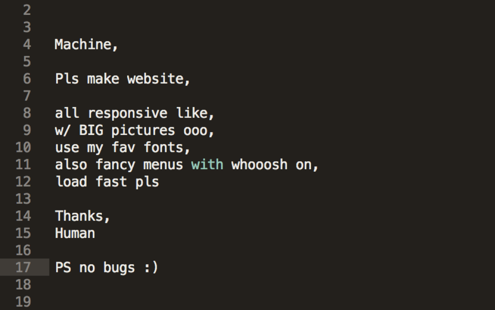

# CS FIG A Week 3
## Engineering Grand Challenges

## Joke of the Day 😆

# Announcements

- Resume due tonight at 6PM!
- I will give feedback, I expect you to read it and re-submit.
- **Common Mistake:** Put Mizzou and your degree (Computer Science, IT, ECE)!

## Cultural Event

- (I told you we would talk about this later) 😏
- As a FIG, we will attend some sort of artistic event in Columbia (Movie, Concert, Play, etc)
- There is an assignment on Canvas
    - Look at the list of potential events
    - Signify which ones you can **NOT** attend.
    - Signify which one you want to attend.

- **Submit your preferences by 6PM on SEPTEMBER 13th**
- The date cannot be pushed back because I have to submit the info the next morning.
- This is REQUIRED to pass the class. 😅
- I will notify you of which one we will attend on September 14.

## What is Computer Science????

- On your own, think of an answer to this question. (1 Minute)

- [https://www.youtube.com/watch?v=AnVBCyzNgaU](https://www.youtube.com/watch?v=AnVBCyzNgaU)

> Computer science is no more about computers than astronomy is about telescopes.
> ~ Edsger W. Dijkstra

- In short, Computer Science isn't just about programming / coding.
- It's the study of computation & algorithms. (Math!)
- Programming is a tool to solve computation problems.
- This may not make sense yet, and that's okay!

## Engineering Grand Challenges

**[Grand Challenge](GrandChallenge.md)**

- You will be proposing a theoretical solution to one of these challenges and working on it throughout the semester.
- Does not have to be perfect!

## Brainstorming

- Break up into groups of 3/4 
- These will be your comrades until the end of the semester. (You better like them)
- You have the rest of the class to complete the first Milestone.
- (Hand it to me on Paper)
    - You can leave when your group is done.