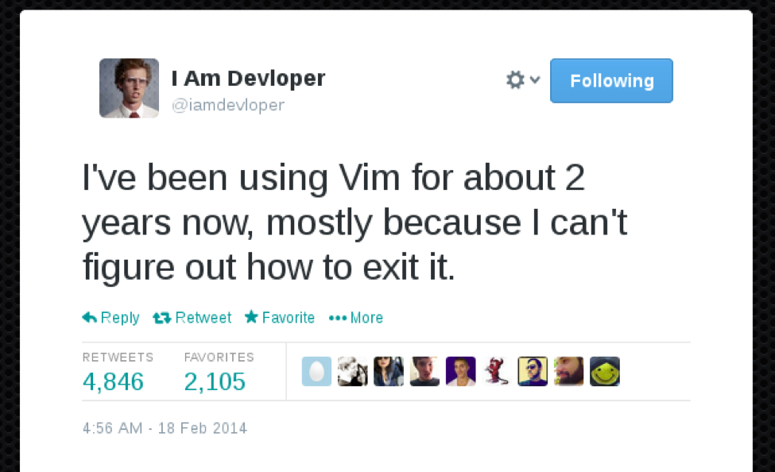
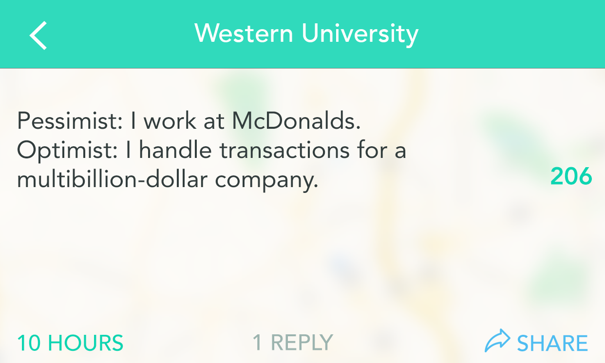

# CS FIG A Week 2
## Career Prep

## Joke of the Day 😆

`[Esc] : wq` If you forgot already

## Intro

- Why are we talking about this already???
- *SURPRISE!* The Engineering Career Fair is September 19!
- Summer Internships are HUGE advantages when applying for full-time.
    - Get your foot in the door early.

## Logistics

- September 19 10AM - 3PM @ Mizzou Arena
    - Show up early if possible!
- Professional Attire Required
- Shuttles from Alumni Center every 15 Minutes
- Research Companies beforehand!
    - See what majors/positions they're hiring for
- Bring lots of copies of your resume (more on that in a minute)
- Get business cards and add recruiters/engineers on LinkedIn

## Challenge 1

- Make a technical resume for the Career Fair
- Create LinkedIn and GitHub Profiles
- Due 1 week from today @ 6PM
- I will give very detailed feedback
- Ask for help if needed!

**[Resume Challenge](ResumeChallenge.md)**

