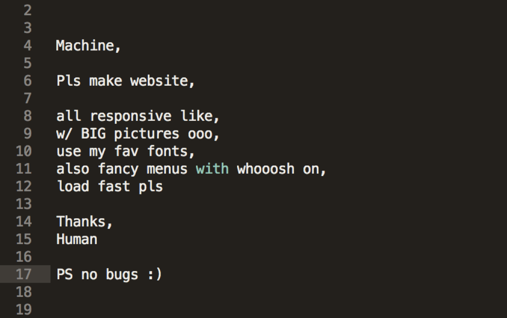

# CS FIG A Week 3
## Engineering Grand Challenges

## Joke of the Day 😆

- You will be proposing a theoretical solution to one of these challenges and working on it throughout the semester.
- Does not have to be perfect!

**[Grand Challenge](GrandChallenge.md)**

## Brainstorming

- Break up into groups
- These will be your comrades until the end of the semester. (You better like them)
- You have the rest of the class to complete the first Milestone.
    - You can leave when your group is done.